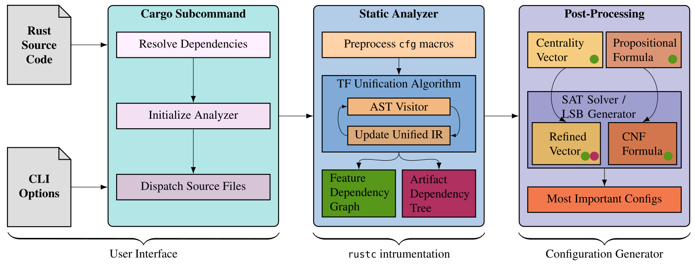

[github-ci]: https://github.com/Favo02/rusty-ex/actions/workflows/ci.yml
[github-ci-shield]: https://github.com/Favo02/rusty-ex/actions/workflows/ci.yml/badge.svg

## RustyEx 🦀

[![GitHub CI][github-ci-shield]][github-ci]

> **TL;DR:**
>
> An instrumented `rustc` that performs [static analysis](https://en.wikipedia.org/wiki/Static_program_analysis?oldformat=true) on Rust crates to extract information about the interactions between [`cfg` features](https://doc.rust-lang.org/cargo/reference/features.html) contained in the codebase.
> The goal is to determine the importance of each feature, to generate the most important configurations of features to test in the context of [SPLs](https://en.wikipedia.org/wiki/Software_product_line).

<details>
  <summary><b>📜 Abstract:</b> <i><ins>dropdown section</ins></i></summary>

[Software Product Lines (SPLs)](https://en.wikipedia.org/wiki/Software_product_line) offer a convenient method for developing large software systems by creating a set of _features_ that share a common core and can be _combined in various ways_ to produce different _final products_.

However, testing SPLs is challenging due to the _combinatorial explosion_ of possible configurations.
This issue is often addressed in the literature using a _$t$-wise approach_ (typically [pairwise](https://en.wikipedia.org/wiki/All-pairs_testing)), which selects a subset of configurations to test that covers all interactions between $t$ features.
This approach may _fail_ when issues arise from combinations involving more than $t$ features.

In this thesis, a new approach is proposed: some features are _more important_ than others, and focusing test cases on these critical features can improve the effectiveness of the testing process.
By using a _graph_ that depicts the interactions between features, the importance of a feature can be determined by its [_centrality_](https://en.wikipedia.org/wiki/Centrality) in the graph.
Different centrality measures can yield different results, making the project adaptable to the specific goals of the tested codebase.

To this end, _RustyEx_ is introduced as a tool for performing _static analysis_ on Rust crates to extract features and their interactions.
This is achieved by _instrumenting_ the Rust compiler ([`rustc`](https://doc.rust-lang.org/rustc/index.html)) and traversing the [_Abstract Syntax Tree_ (AST)](https://en.wikipedia.org/wiki/Abstract_syntax_tree).
During the visit, _RustyEx_ collects information about the features, building a _custom tree_ that represents each piece of the code along with its features and their importance, represented as weight.

This internal tree is then used to construct two resulting graphs: the _Features Dependency Graph_, with a focus on feature dependencies and interactions; and the _Artifact Dependency Tree_, which offers a more detailed view of the pieces of code annotated by features.
These graphs are then analyzed to determine the most important features, which will be further used to generate _valid configurations_ for testing.

</details>

🎓 **Full Thesis**: [`thesis.pdf`](https://github.com/Favo02/rusty-ex/releases/download/thesis-release/thesis.pdf)

📊 **Complete Results**: [`projects-table.pdf`](https://github.com/Favo02/rusty-ex/releases/download/thesis-release/projects-table.pdf) [`crates-table-part1.pdf`](https://github.com/Favo02/rusty-ex/releases/download/thesis-release/crates-table-part1.pdf) [`crates-table-part2.pdf`](https://github.com/Favo02/rusty-ex/releases/download/thesis-release/crates-table-part2.pdf)

<br />

> [!WARNING]
> `RustyEx` is under active development, this documentation or the attached documents _(especially my thesis)_ may be outdated soon.



<br />

## Table of Contents

- [Introduction](#rustyex)
- [Definitions](#definitions)
- [Installation and Usage](#installation-and-usage)
  - [Setup](#setup)
  - [Install the cargo plugin](#install-the-cargo-plugin)
  - [CLI Usage: `cargo-rusty-ex`](#cli-usage-cargo-rusty-ex)
  - [Run on multiple crates (and merge result): `deserializer-merger`](#run-on-multiple-crates-and-merge-result-deserializer-merger)
  - [Test](#test)
  - [Usage without installation](#usage-without-installation)
  - [Benchmarks](#benchmarks)
  - [More](#more)

## Definitions
- ***Feature***: a togglable piece of functionality that can be included or excluded from the final product;

- ***Rust Feature***: an identifier that can be used to conditionally include or exclude a piece of code (a term) from the final product;

- ***Rust Term***: a piece of code that _can_ be annotated by a feature. This includes item declarations (such as functions or structs), statements, and expressions;

- ***Rust Artifact***: a term annotated by a feature;

- ***Global Scope***: the root of the codebase; it contains all features, terms, and artifacts and is conventionally annotated with the _Global_ feature;

- ***Feature importance (or weight)***: the importance of a feature increases with the number of other features that depend on it. Additionally, the larger the piece of code (artifact) controlled by a feature, the more important it is;

- ***Dependency***: a node (either a feature, a term, or an artifact) is said to depend on another node if its inclusion or execution is influenced by the inclusion or execution of the other node. In code terms, a feature or a term depends on another node if it is nested within the scope of the other node;

- ***Dependency graph***: a general rooted graph that illustrates dependencies between nodes, where the root is the global scope.
Dependencies are depicted as directed edges, where the source node depends on the target node.
Depending on the nature of the nodes, the graph could be acyclic, forming a tree;

- ***Unified Intermediate Representation (UIR) or Terms Dependency Tree***: a dependency graph with nodes representing terms in a codebase.
Since each term can depend on at most one other term and because of the uniqueness of each term, there can be no circular dependencies, making the graph a tree, rooted at the global scope;

- ***Features Dependency Graph***: a dependency graph with nodes representing Features in a codebase.
Unlike terms, features are not unique, meaning a feature can depend on different features in different contexts, creating possible circular dependencies;

- ***Artifacts Dependency Tree***: a dependency graph where the nodes represent artifacts (terms annotated with features), within a codebase.
Since each artifact can depend on at most one other artifact and because of the uniqueness of each artifact, there can be no circular dependencies, making the graph a tree.

## Installation and Usage

### Setup

Setup the nightly toolchain:

```bash
rustup toolchain install nightly-2025-02-20
rustup component add --toolchain nightly-2025-02-20 rust-src rustc-dev llvm-tools-preview rust-analyzer clippy
```

### Install the cargo plugin

Install all the binaries:

```bash
cd rusty_ex
cargo install --bins --path .
```

Use the installed binaries:

```bash
cargo-rusty-ex [--PLUGIN_ARG]
deserializer-merger [--PLUGIN_ARG]
rusty-ex-driver [--PLUGIN_ARG]
```

> [!IMPORTANT]
> The compilation of the analyzed crates is going to fail. `error: could not compile [crate_name]` is expected.

### CLI Usage: `cargo-rusty-ex`

Available plugin args for `cargo-rusty-ex`:

- Graphs in DOT format:
  - `--print-terms-tree`: print the terms tree (unified intermediate representation - UIR)
  - `--print-features-graph`: print the features graph (after squashing)
  - `--print-features-multigraph`: print the features multigraph
  - `--print-artifacts-tree`: print the artifacts tree
- Other:
  - `--print-crate`: print the crate AST
  - `--print-centrality`: print some centralities of the features graph
  - `--print-serialized-graphs`: print the extracted graphs serialized
  - `--print-metadata`: print metadata of extracted graphs in JSON format

Example usage:

```bash
cd [example_crate_name]
cargo-rusty-ex [--PLUGIN_ARG]

# example:
cd crate_name
cargo-rusty-ex --print-features-graph
```

> [!NOTE]
> Additional logs can be enabled by setting the `RUST_LOG` environment variable to `debug`.

### Run on multiple crates (and merge result): `deserializer-merger`

> [!WARNING]
> Currently, it is possible to analyze only a single crate (in workspace projects only the root crate will be analyzed).
> A workaround is to analyze each crate independently and them merge results, using the `deserializer-merger` utility.
> For workspace crates, resetting the `Cargo.toml` to a single crate is necessary.

Serialize the graphs of the crates you want to analyze and save the results in a file:

```bash
cd ~/crate_1
cargo-rusty-ex --print-features-graph > crate_1.json

cd ~/crate_2
cargo-rusty-ex --print-features-graph > crate_2.json
```

Execute the `deserializer-merger`, passing as `-f` argument the files containing the serialization and a plugin arg:
- `--print-terms-tree`: print the merged terms tree
- `--print-features-graph`: print the merged features graph
- `--print-artifacts-tree`: print the merged artifacts tree

Example usage:

```bash
deserializer-merger [--PLUGIN-ARG] -f crate_1.json -f crate_2.json

# example:
deserializer-merger --print-features-graph -f crate_1.json -f crate_2.json
```

### Test

Run tests on all example workspaces:

```bash
cd rusty_ex
cargo test --no-fail-fast -- --test-threads=1
```

> [!WARNING]
> Some tests are expected to fail. Run with `--no-fail-fast` to always run all test (even if some early test fails).
>
> Any test with `macro` in the name is expected to fail because macros are already expanded in the AST we access, meaning some information about them is lost (this is better explained somewhere in the thesis).

### Usage without installation

Use the cargo plugin without installing (from the root of this repository):

```bash
cd rusty_ex/tests/workspaces/[example_crate_name]
cargo run --manifest-path ../../../Cargo.toml --bin cargo-rusty-ex [--CARGO_ARG] -- [--PLUGIN_ARG]

# example:
cd rusty_ex/tests/workspaces/simple_feature_no_weights
cargo run --manifest-path ../../../Cargo.toml --bin cargo-rusty-ex -- --print-features-graph
```

### Benchmarks

Benchmark scripts are available in the `benchmarks` directory.

Prerequisites:

- python environment with `requirements.txt` installed
- installed `cargo-rusty-ex` binary

Usage:

- `benchmark.py` will clone and analyze automatically all the repositories listed in the `TO_ANALYZE` hardcoded list, generating:
  - `data/analyzed-crates.json` file containing the results of each single crate analysis
  - `data/analyzed-projects.json` file containing the results of the analysis aggregated by project
- `format.py` will format the files in `data/` into a LaTeX table
- `data-analysis.ipynb` is a Jupyter notebook used for some statistical analysis of the results

### More

The thesis document contains a more detailed explanation of the project, including the motivation (Chapter _Introduction_ and _Background_), the implementation (Chapter _Concept and Implementation_), the results (Chapter _Results_), the limitations and future work (chapter _Conclusions_).
